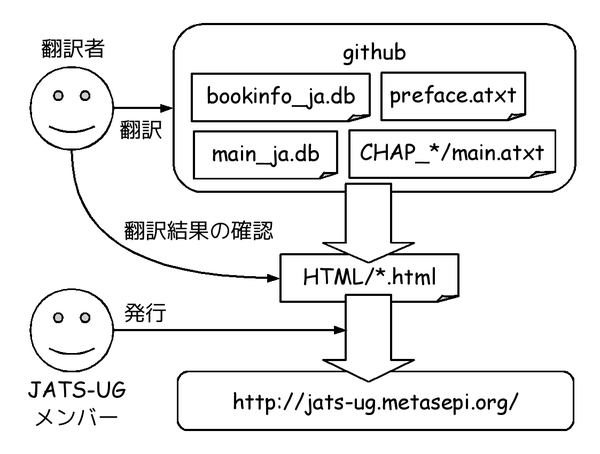
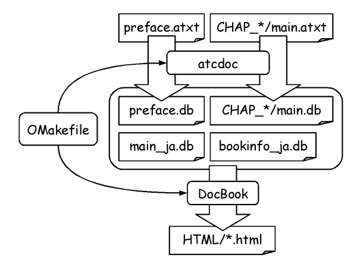

# ATS2の公式マニュアルの日本語訳

## 文書リスト

### ATSプログラミング入門

* 日本語: http://jats-ug.metasepi.org/doc/INT2PROGINATS/
* 元データ: https://github.com/jats-ug/ATS-Postiats/tree/translate_ja/doc/BOOK

### A Tutorial on Programming Features in ATS

* 日本語: 未着手
* 元データ: https://github.com/jats-ug/ATS-Postiats/tree/translate_ja/doc/BOOK/ATS2TUTORIAL

## 翻訳環境

### 概要



翻訳環境は大きく翻訳作業と発行作業の2つに分れています。
発行作業は
[JATS-UGのメンバー](https://github.com/jats-ug?tab=members)
しかできませんが、翻訳作業はどなたでも可能です。
誤字や未訳を見つけたらpull requestをいただけたら助かります。

githubリポジトリにたまった翻訳は適切なタイミングで
[JATS-UGのメンバー](https://github.com/jats-ug?tab=members)
が発行します。

### 準備

ATSの作者であるHongwei Xiは
[DocBook](http://www.docbook.org/)
の上に
[atsdoc](http://www.ats-lang.org/htdocs-old/DOCUMENT/atsdocman/atsdocman.html)
というレイヤーを重ねて執筆をしています。
そのため翻訳環境も少し特殊になっています。



おそらくこの翻訳のための準備は https://github.com/master-q に押し付けた方が良いでしょう。
まず、OMakefileを作りましょう。
詳しくは
https://github.com/jats-ug/ATS-Postiats/blob/translate_ja/doc/BOOK/INT2PROGINATS/OMakefile
を参照してください。

日本語化したファイルは全てUTF8エンコーディングで保存してください。
main_ja.dbにはなぜかファイル頭にEUC-JPとか書いてありますが、UTF8で保存してください。
atsdocを通した後にUTF8からEUC-JPにMakefileが変換をかけます。

さらに、
[ATEXT/int2proginats.dats](https://github.com/jats-ug/ATS-Postiats/blob/translate_ja/doc/BOOK/INT2PROGINATS/ATEXT/int2proginats.dats)
ファイルを編集して、日本語を扱うマクロであるlangjaを作ります。

```ocaml
(*
macdef
langeng (x) = atext_strsub ,(x)
*)
macdef langeng (x) = ignorestr ,(x)
(*
macdef
langchin (x) = atext_strsub ,(x)
*)
macdef langchin (x) = ignorestr ,(x)
macdef
langja (x) = atext_strsub ,(x)
(*
macdef langja (x) = ignorestr ,(x)
*)
```

langengは英語、langchinは中国語、langjaは日本語用のマクロです。

### 翻訳作業

[preface.atxt](https://github.com/jats-ug/ATS-Postiats/blob/translate_ja/doc/BOOK/INT2PROGINATS/preface.atxt)
を例にして練習しましょう。簡単です。

```
<preface>
#langeng("
#title("Preface")
")
#langchin("
#title("序言")
")
#langja("
#title("前書き")
")
```

langengというマクロで囲まれている部分は英語のドキュメント。langchinマクロは中国語。
langjaは日本語のマクロです。
先の
[ATEXT/int2proginats.dats](https://github.com/jats-ug/ATS-Postiats/blob/translate_ja/doc/BOOK/INT2PROGINATS/ATEXT/int2proginats.dats)
ファイルの宣言によって、この3つのマクロのどれがDocBookであるdbファイルに出力されるのかは制御できます。
さっきの準備でlangjaのみ生かすように設定したので、
atsdocによってこの部分は以下のようなDocBookに変化します。

```
<preface>
#title("前書き")
```

langengに書こまれていないパラグラフは、単にlangengで囲んだ後、
対応する日本語をlangjaマクロで囲めば翻訳完了です。
保存する文字コードはUTF8を選択してください。

pull requestお待ちしています!

### 発行作業(もしくは翻訳結果の確認)

まずATS-Anairiatsのアーカイブを以下のURLから取ってきます。

http://sourceforge.net/projects/ats-lang/

取得したATS-Anairiatsをビルドしましょう。
インストールはしなくても大丈夫です。

```
$ tar xfz ats-lang-anairiats-0.2.11.tgz
$ cd ats-lang-anairiats-0.2.11
$ ./configure
$ make
--snip--
ATS/Anairiats has been built up successfully!
The value of ATSHOME for this build is "/home/kiwamu/src/ats-lang-anairiats-0.2.11".
The value of ATSHOMERELOC for this build is "ATS-0.2.11".
```

ATSHOMEとATSHOMERELOCを環境変数に設定しましょう。

```
$ export ATSHOME=/home/kiwamu/src/ats-lang-anairiats-0.2.11
$ export ATSHOMERELOC=ATS-0.2.11
```

準備がととのったので、ATS-Postiatsのマニュアルをビルドしましょう。

```
$ sudo apt-get install docbook-utils
$ git clone https://github.com/jats-ug/ATS-Postiats.git
$ cd ATS-Postiats
$ git checkout translate_ja
$ cd doc/BOOK/INT2PROGINATS
$ make html_ja -j4
$ ls HTML/index.html
HTML/index.html
```

あとは
[jats-ug.github.io](https://github.com/jats-ug/jats-ug.github.io)
リポジトリにコピーして、git pushすれば発行作業は完了です。

```
$ make publish_jats_ug
  cp -rf HTML/* /home/kiwamu/doc/jats-ug.github.io/doc/INT2PROGINATS/
$ cd ~/doc/jats-ug.github.io
$ git add .
$ git commit -m "Update doc"
$ git push
```

## 古いメモ

[古いメモ](memo.md)
を試行錯誤の履歴として保管していあります。
