# 状態を持つ観 (view) を通じてポインタを扱う安全なプログラミング

(元論文は http://www.ats-lang.org/PAPER/SPPSV-padl05.pdf です。)

Dengping Zhu and Hongwei Xi

## 概要

ポインタを用いてメモリを直接扱うことは多くのアプリケーションにとって必要不可欠です。
けれども、ポインタの使用 (もしくは誤用)
がしばしばプログラムエラーの主要因であることもよく知られています。
そのため、プログラミングにおいてポインタを安全に使用することを効果的に強制するアプローチがこれまでさかんに探求されてきました。
ATS は、最近開発されたフレームワーク Applied Type System
に基づいた型システムを持ったプログラミング言語です。
いままでにない魅力的な ATS の機能の1つが、状態を持つ観 (view)
の概念を通してポインタを扱う安全なプログラミングのサポートです。
特にポインタ演算でさえ ATS では使用でき、しかも ATS
の型システムによって安全であることが保証されています。
この論文では、ATS のこの機能について概要を紹介し、ATS
のプロトタイプ実装におけるいくつかの興味深い例を示します。
これは状態を持つ観を通じてポインタを扱った安全なプログラミングの実用性を実証しています。

## 1. はじめに

仕様に配慮して正確かどうかプログラムを検証することは、プログラミングにおいていまだ重要課題です。
この根本的な問題を解決するために多くのアプーチが考案されてきました
(例: ホーア論理 [Hoa69,AO91], モデル検査 [EGP99])。
しかし、一般的なソフトウェアに適用するにはしばしばそれらは高価です。
例えばホーア論理は短かいプログラムの正確さを、しばしばプログラムを複雑化させますが、証明できます。
またそのようなプログラムにはいくつか捉えにくい問題を同定できます。
より大きなプログラムを自動定理証明の助けを借りて扱うことはできますが、実際のプログラミング言語においてホーア論理をサポートするのと同様に挑戦的な課題でしょう。
一方で、プログラムの型の検証、つまり型検査、は ML や Java のような規模の言語においても実用的です。
けれども ML や Java の型は、ホーア論理と比較すると比較的限定された表現力しかありません。
そこで、私達は型検査によってより複雑な性質を捕捉して検証可能な型システムを作ろうと考えました。

重たいアプローチは、プログラムの高度に洗練された性質を捕捉できるような型システムを採用することです。
例えば、Martin-Löf によって作られた型理論に基づいた NuPrl [C+86] の型システムがあります。
このような型システムでは型は大変表現豊かですが、型検査はしばしば相当量の定理証明を伴ない、自動化しにくいものになりえます。
これは本質的に、スケーラビリティより表現力を強く意図したアプローチなのです。

私達は依存型の限定された形の概念を導入する軽いアプローチを採用しています。
そこでは型による式と実行時の式を明確に分離しています。
関数型プログラミングでは、ML の型システムを依存型を用いて改良して、関数型プログラミング言語
DML (Dependent ML) [Xi98,XP99] のデザインに辿り着きました。
命令型プログラミングでは、依存型をサポートするC言語風構文のプログラミング言語 Xanadu
をデザインしました。
別の関連する研究ですが、guarded recursive (g.r.)
データ型と呼ばれる新しい型の概念が近年導入されました [XCC03]。
(DML で開発した) 依存型の制約された型と g.r.
データ型の間の親密な類似に注目して、私達はすぐに両方の型を統合したフレームワークのデザインを開始し、
_Applied Type System (ATS)_ [Xi03,Xi04] の形式化を導きました。
私達は今、 _ATS_ に基づいた型システムを持つ ATS プログラミング言語をデザインしている最中です。
(最小限のドキュメントと多くの使用例を含む) ATS のプロトタイプはオンラインから入手できます [Xi03]。
Martin-Löf によって作られた型理論における依存型と区別するために、
ここでは _ATS スタイルの依存型_ という用語を _ATS_
における依存型を表わすのに使っていることに注意してください。

```ocaml
(* 図1. ATS における単純はコード例 *)
fun arrayAssign {a:type, n:nat} (A:array (a,n), B:array (a,n)): unit =
  let
    fun loop {i:nat | i <= n} (ind: int (i)): unit =
      if ind < length A then
        (set (B, ind, get (A, ind)); loop (ind + 1))
  in
    loop (0)
  end
```

ATS は包括的なプログラミング言語で多用なプログラミングパラダイム
(例: 関数型プログラミング, オブジェクト指向プログラミング, 命令型プログラミング,
モジュラープログラミング, メタプログラミング)
をサポートするようデザインされています。
そして ATS のコアは値渡しの関数型プログラミング言語です。
この論文では、ATS のポインタを使ったプログラミングに注目します。

今のところ依存型を用いたプログラミングは一般的ではないので、読者に依存型がどのようにプログラムの不変条件を捕捉するのに使えるのか実感してもらうために具体例を使います。
図1では、1つの配列の内容物を別の配列に割り当てる関数 arrayAssign を実装しています。
関数 arrayAssign の定義におけるヘッダは arrayAssign
に次の型が割り当てられていることを意味しています:

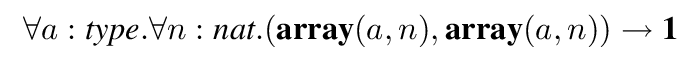

__1__ はユニット型を表わし、おおざっぱに言うとC言語の void 型に相当します。
型 _T_ と整数 _I_ が与えられた時、 __array__ ( _T_ , _i_ )
はそれぞれの要素に型 _T_ が割り当てられたサイズ _I_ の配列の型を表わします。
従って、 _arrayAssign_ に与えられた型は
_arrayAssign_ が2つの同じサイズの配列にのみ適用できることを示しています。
量化 ∀ _a_ : _type_ と ∀ _n_ : _nat_ はそれぞれ _a_ と _n_
がなんらかの与えられた型と自然数でインスタンス化されることを意味しています。
内部関数 _loop_ には次の型が割り当てられています:
∀ _i_ : _nat.i_ ≤ _n_ ⊃ ( __int__ ( _i_ ) → __1__ ) 。
整数 _I_ が与えられた時、
__int__ ( _I_ ) は _I_ を表わすシングルトン型で、
つまり型 __int__ ( _I_ ) の唯一の値は _I_ に等しくなります。
_loop_ に与えられた型は、
_arrayAssign_ の引数のサイズである _n_ 以下の値を持つ自然数にのみ
_loop_ を適用できることを意味しています。
ATS では、
_i_ ≤ _n_ をガードと呼び、
_i_ ≤ _n_ ⊃ ( __int__ ( _i_ ) → __1__ ) をガードされた型と呼びます。
また、関数 _length_ には次の型が与えられます:

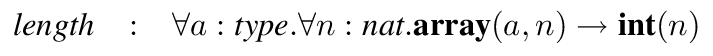

そしてその配列の添字関数 _get_ と配列の更新関数 _set_ には次の型が与えられます:

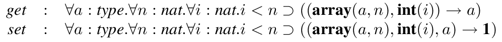

これは配列にアクセスするインデックスが配列の境界の中におさまっていることを示しています。

ポインタを用いた安全なプログラミングをサポートするために、ATS
にはメモリレイアウトをモデル化するために _状態を持つ観 (view)_ と呼ばれる概念が導入されています。
型 _T_ とアドレス _L_ が与えられたとき、アドレス _L_ に保存された型 _T_
の値を表わす (状態を持つ) 観を表現するために _T_ @ _L_ を用います。
これはプリミティブな観として唯一の形で、それ以外全ての観はこのようなプリミティブな観の上に構築されています。
例えば、型 _T_ の値ともう一つの型 _T'_ の値がそれぞれアドレス _L_ と _L_ + 1
に格納されていることを意味する観 ( _T_ @ _L_, _T'_ @ ( _L_ + 1)) を作ることができます。
状態を持つ観は型に似ていて、ある項に割り当てることができます。
それは状態を持つ観の証明の項 (もしくは単に証明) としばしば呼ばれます。
観の証明は、生成されたり消費されたりするようなリソースの形のように扱われます。
特に、観の上における型理論は線形論理 [Gir87] に基づいています。

関数によっては適用されるとき、状態を持つ観の証明を要求します。
それらは実行時に状態を持つ観を変化させるのです。
例えば、関数 _getVar_ と _setVar_ には次の型が与えられています:

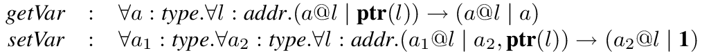

ここでは、与えられたアドレス _L_ を指すポインタを表わすシングルトン型として
__ptr__ ( _L_ ) を使っています。
_getVar_ に割り当てられた型は、なんらかの型 _T_ とアドレス _L_
についての観の証明 _T_ @ _L_ と型 __ptr__ ( _L_ ) の値を取り、観の証明
_T_ @ _L_ と型 _T_ の値を返す関数を意味しています。
この場合、観の証明 _T_ @ _L_ は消費されて別の観の証明 _T_ @ _L_
が生成される、と言えます。
証明は型検査を行なうためにコンパイル時でのみ使われ、それらは実行時には必要なく有効でさえないことを強調させてください。
与えられたポインタから読み出す関数として _getVar_ をここでは使っています。
_getVar_ の証明引数は _getVar_
に渡されるポインタが指すアドレスにある型の値が格納されていることを示しているので、その証明引数は本質的にそのポインタが宙ぶらりんなポインタ
(dangling pointer) ではないと見なすことに注意してください。

関数 _setVar_ に割り当てられた型も似た作法で理解できます:
_setVar_ は、型 _T1_ とアドレス _L_ における観の証明 _T1_ @ _L_ と型 _T2_ の値と型 __ptr__ ( _L_ )
の値を取り、観の証明 _T2_ @ _L_ と (型 __1__ の) ユニットを返します。
この場合、観の証明 _T1_ @ _L_ は消費されて別の観の証明 _T2_ @ _L_
が生成される、と言えます。
_setVar_ は与えられたアドレスに書き込む関数として使われ、
この変更は関数 _setVar_ が呼び出される前後の状況を正確に反映しています:
呼び出し前では型 _T1_ の値が _L_ に格納されており、呼び出し後では型
_T2_ の値が _L_ に格納されていることになります。

関数 _allocVar_ と _freeVar_ はそれぞれあるメモリ単位を確保と解放します。
それらの型は次のように与えられます:

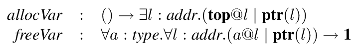

トップ型を表わすのに __top__ を使います。
つまり全ての型は __top__ のサブタイプになります。
_allocVar_ は呼び出されると、どこかのアドレス _L_ について観の証明 __top__ @ _L_ と型 __ptr__ ( _L_ ) のポインタを返します。
そのポインタを通じた書き込み操作を行なうのであれば、この証明が必要になります。
もう一方で _freeVar_ を呼び出すとポインタにアクセスすることができなくなります。

```ocaml
(* 図2. 単純なスワップ関数 *)
fun swap {t1:type, t2:type, l1:addr, l2:addr}
    (pf1: t1 @ l1, pf2: t2 @ l2 | p1: ptr (l1), p2: ptr (l2))
  : '(t1 @ l2, t2 @ l1 | unit) =
  let
    val '(pf1 | tmp1) = getVar (pf1 | p1)
    val '(pf2 | tmp2) = getVar (pf2 | p2)
    val '( pf1' | _ ) = setVar (pf1 | p1, tmp2)
    val '( pf2' | _ ) = setVar (pf2 | p2, tmp1)
  in
    '(pf2', pf1' | '())
  end
```

例として、図2で実装されている関数は2つの異なるアドレスに保存されている内容物をスワップします。
タプルを作るのには '(...) を使います。クオート記号 (') は単に構文解析のためです。
またバー記号 (|) は (コンマ記号 (,) のように) 区切りとして使われます。

上記の実装では証明は明確にコントロールされていて、プログラマの重荷になりうることに注意してください。
ATS では、暗黙的に証明を消費したり生成したりすることを許しています。
例えば、ATS において図2の関数は次のように実装することもできます:

```ocaml
fun swap {t1:type, t2:type, l1:addr, l2:addr}
    (pf1: t1 @ l1, pf2: t2 @ l2 | p1: ptr (l1), p2: ptr (l2))
  : '(t1 @ l2, t2 @ l1 | unit) =
  let val tmp := !p1 in p1 := !p2; p2 := tmp end
```

このとき _getVar_ を表わすのに ! を、
_setVar_ を表わすのに := をを使い、暗黙的な作法によって証明を扱います。

この論文の主な目的は、型理論に対して正式なトレーニングを十分に積んでいるかどうかにかかわらず、幅広い読者に
ATS を理解してもらうことです。
そこで脅えさせるような ATS
の理論的詳細にはできるかぎり踏み込まず、ポインタを用いた安全なプログラミングをサポートする状態を持つ観の使用のすっきりと直感的な導入を得ようと努力することにします。
ATS の技術面に興味がある読者には、より詳細を理解するために [Xi03] をおすすめします。
また、ATS のプロトタイプ実装と多くの興味深い使用例はオンラインから入手できます [Xi03]。

この論文の残りは次のように編成されています。
2節では、ATS におけるいくつかの (一般的でない) 型について概要を示します。
3節では、ATS
において安全にポインタを用いてどのようにプログラミングを行なうか示すために、いくつかの例を紹介します。
4節ではいくつか関連研究について言及し、5節で結論を述べます。

## 2. ATS/SV について簡単に

この節では、ATS における (ポインタを用いた) 命令型プログラミングをサポートする型システムである _ATS/SV_ の概要紹介します。
Applied Type System として、 _ATS/SV_ には2つの構成要素があります:
静的な構成要素 (静的な世界 (statics)) と動的な構成要素 (動的な世界 (dynamics)) です。
本質的に、静的な世界と動的な世界はそれぞれ型とプログラムを扱います。
ここでは _ATS/SV_ の静的な世界に注目しましょう。

#### 図3. _ATS/SV_ の静的な世界を表わす構文

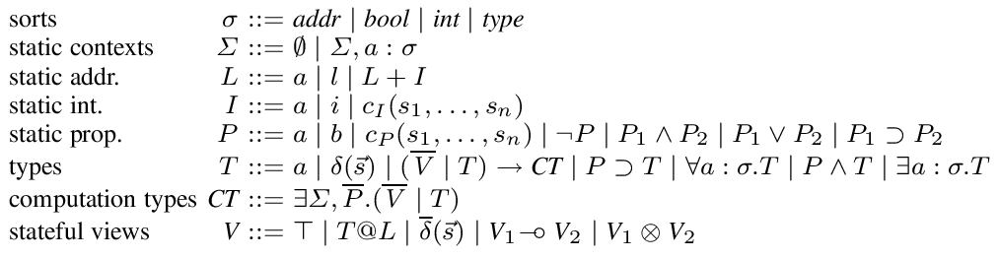

_ATS/SV_ の静的な世界の構文が図3で与えらています。
静的な世界自身は単純な型付き言語で、その型は _種 (sort)_ と呼ばれます。
_ATS/SV_ においては次の基本的な種の存在を仮定しています:
_addr_ , _bool_ , _int_ , _type_ です;
_addr_ はアドレスを表わす種、
_bool_ はブール常数を表わす種、
_int_ は整数を表わす種、
_type_ は (動的な項、すなわちプログラムに割り当てられる)
型を表わす種です。
静的な変数を表わすのに _a_ を、アドレス定数 __l0__ , __l1__ ,...
を表わすのに _l_ を、ブール値 _tt_ と _ff_ を表わすのに
_b_ を、整数 0,-1,1,... を表わすのに _i_ を用います。
静的な世界の項 _s_ は静的な項と呼ばれます。
また、 _Σ_ ⊢ _s_ : _σ_ は _s_ に _Σ_ の下で種 _σ_
を割り当てることができることを意味しています。
種を静的な項に割り当てる規則は、大変一般的なので省略します。
また種 _addr_ , _bool_ , _int_ , _type_
の静的な項を表わすのに、それぞれ
_L_ , _P_ , _I_ , _T_ を使うことがあります。
種 _int_ の静的な項を作るとき、いくつかのプリミティブな関数 _cI_ を仮定します;
例えば、 _I1_ + _I2_ , _I1_ - _I2_ , _I1_ * _I2_ , _I1_ / _I2_
のような項を作ることができます。
また、種 _bool_ の静的な項を作るとき、あるプリミティブな関数 _cP_ を仮定します;
例えば _I1_ ≤ _I2_ や _I1_ ≥ _I2_ のような命題を作ることができます。
そしてそれぞれの種 _σ_ について、もし _s1_ と _s2_ が種 _σ_
の静的な項であれば、命題 _s1_ =σ _s2_ を作ることができます;
もしこの文脈から容易に推察できるのであれば、=σ
の下付き文字はの説明は省略できるかもしれません。
さらに _L_ と _I_ が与えられたとき、もし _L_ = __ln__ で _I_ = _i_ で _n_ + _i_ ≥ 0
であれば、 __ln+i__ に等しいアドレス _L_ + _I_ を作ることができます。

静的な項の列を表わすのに _ś_ を使い、
命題, 型, 観の列を表わすのに
_Ṕ_ , _Ť_ , _Ṽ_ をそれぞれ使い、
空の列を表わすのに ∅ を使います。
アドレスから値への有限写像の状態を表わすのに _ST_ を使い、
_ST_ の定義域を表わすのに __dom__ ( _ST_ ) を使います。
もし _ST_ ( _l_ ) = _v_ であるなら、 _l_ に値 _v_ が格納されていると言えます。
適切なボックス化ができるよう保管するために、全ての値は1つのメモリ単位を取ることを仮定していることに注意してください。
2つの状態 _ST1_ と _ST2_ が与えられたとき、
もし __dom__ ( _ST1_ ) ∩ __dom__ ( _ST2_ ) = ∅ であるなら、
_ST1_ と _ST2_ の和集合を _ST1_ ꕕ _ST2_ と書きます。
_ST_ : _V_ は状態 _ST_ が観 _V_ を満たすことを意味します。
ここで観と型について、いくつかの直感的な解釈を紹介します。

* 空の状態、つまり定義域が空である状態、によって満たされる空の観を表わすのに ⊤ を使います。
* 観のコンストラクタを表わすのに 𝛿 を使い、⊢ 𝛿 ( _σ1_ ,..., _σn_ ) は種 _σ1_ ,..., _σn_ の静的な項 _s1_ ,..., _sn_ にそれぞれ 𝛿 を適用して、観 ⊢ 𝛿 ( _s1_ ,..., _sn_ ) を生成することを意味しています。∀ _Σ_ , _Ṕ_ . ( _Ṽ_ ) ⊸ 𝛿 ( _ś_ ) の観が割り当てられた 𝛿 それぞれに観の証明コンストラクタ _c_ が存在します。例えば、3節 図6の (再帰的に定義された) 観のコンストラクタ _arrayView_ は、型 _T_ , 整数 _I_ , アドレス _L_ に適用すると観 _arrayView_ ( _T_ , _I_ , _L_ )を作ります; _arrayView_ に関連した2つの証明コンストラクタは _ArrayNone_ と _ArraySome_ です。
* _L_ と _T_ が与えられたとき、プリミティブな観 _T_ @ _L_ を作ることができます。この観は _L_ を型 _T_ に写像する状態によって満たされます。
* _V1_ と _V2_ が与えられたとき、 __dom__ ( _ST1_ ) ∩ __dom__ ( _ST_ ) = ∅ であるどのような状態 _ST1_ : _V1_ についても _ST1_ ꕕ _ST_ が _V2_ を満たすならば、状態 _ST_ は _V1_ ⊸ _V2_ を満たします。
* _V1_ と _V2_ が与えられたとき、なんらかの _ST1_ : _V1_ と _ST2_ : _V2_ について _ST_ = _ST1_ ꕕ _ST2_ ならば、状態 _ST_ は _V1_ ꕕ _V2_ を満たします。
* 一般に、 _ATS/SV_ のプリミティブ型を表わすのに 𝛿 ( _ś_ ) を使います。例えば __top__ はトップ型で、すなわち全ての型は __top__ のサブタイプです; __1__ はユニット型です; __ptr__ ( _L_ ) は _L_ に等しいアドレスのみを含むシングルトン型で、また型 __ptr__ ( _L_ ) の値を ( _L_ を指す) ポインタと呼ぶこともできます; __bool__ ( _P_ ) は _P_ に等しいブール値のみを含むシングルトン型です; __int__ ( _I_ )は _I_ に等しい整数のみを含むシングルトン型です。
* ( _Ṽ_ | _T_ ) → _CT_ は、(関数適用が起きた時の) 現状態が観 _Ṽ_ を満たす場合にのみ、型 _T_ の値に適用できる (動的な) 関数を表わす型です。そのような関数適用は ∃ _Σ'_ , _Ṕ'_ .( _Ṽ'_ | _T'_ ) の形の計算型 _CT_ を割り当てできる動的な項を生じます。この形の計算型は動的な項が、いくつかの静的な置換 _Θ_ について、 _Ṕ'_ [ _Θ_ ] のそれぞれの命題が真であり、 _v_ の型が _T'_ [ _Θ_ ] であり、 _ST_ が _V'_ [ _Θ_ ] を満たすような状態 _ST_ において値 _v_ を評価すると期待されることを直感的に意味しています。これより後では (∅ | _T1_ ) → ∃∅,∅.(∅ | _T2_ ) の略記として _T1_ → _T2_ を使い、これは状態のない関数型と呼ばれます。
* _P_ ⊃ _T_ はガードされた型と呼ばれ、 _P_ ⋀ _T_ は表明型と呼ばれます。例として、次の型は自然数から負の整数への関数を表わします:

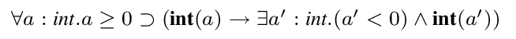

ガード _a_ ≥ 0 はこの関数を0以上の整数にのみ適用可能なことを示しています; 表明 _a'_ < 0 は関数が返す整数が負の数であることを意味しています。

_ATS/SV_ には2つの制約の形があります: 型等式を定義する必要がある、 _Σ_ ; _Ṕ_ |= _P_ (永続 (persistent)) と _Σ_ ; _Ṕ_ ; _Ṽ_ |= _V_ (短命 (ephemeral)) です。
一般的に言うと、私達は直観論理と直感線形論理をそれぞれ永続的な制約と短命な制約を論証するために使います。
_Σ_ ; _Ṕ_ |= _P_ が _Ṕ0_ の全ての _P_ を保つことを意味するのに _Σ_ ; _Ṕ_ |= _Ṕ0_ と書くことができます。
永続的な制約のための規則の多くは一般的なので省略します。
例えば、次の規則が利用できます:

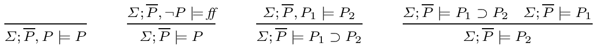

種 _type_ の静的な項におけるサブタイプ関係 _T1_ ≤tp _T2_ 導入し、
_T1_ ≤tp _T2_ ⋀ _T2_ ≤tp _T1_ である型等式 _T1_ =type _T2_ を定義します。
サブタイプ判定は _Σ_ ; _Ṕ_ |= _T1_ ≤tp _T2_ の形を取り、そのような判定を導く規則は図4で与えられます。
この規則に関連する明らかな側面は省略します。
_n_ ≥ 1 について _Ṽ_ = _V1_ ,..., _Vn_ で、
_Ṽ_ が空もしくは _V1_ ꕕ...ꕕ _Vn_ であるなら ⟙ であるような、
ꕕ( _Ṽ_ ) が定義されていることに注意してください。
規則 ( __ext__ ) において、 _CT_ が ∃ _Σ_ , _Ṕ_ .( _Ṽ_ | _T_ ) で _Σ_ に _V_
の自由変数が存在しないとき、∃ _Σ_ , _Ṕ_ .( _Ṽ_ , _V_ | _T_ ) を表わすのに _CT_ [ _V_ ]
と書きます。
分離論理 (separation logic) [Rey02] に馴染みのある読者には、この規則は本質的にその分離論理の
frame rule に相当することを指摘しておきます。
規則 ( __ext__ ) は本質的には:
例えば、関数の型が ( _Ṽ_ | _T_ ) → _CT_ であり、現状態が
_Ṽ0_ = _Ṽ1_ , _V_ かつ ∅;∅; _Ṽ1_ |= ꕕ( _Ṽ_ ) が導出可能な観 ꕕ( _Ṽ0_ ) を満たすと想像できます。
現状態においてその関数を適用し、観 _V_ を"持ち越す"ことができるように、その関数には型
( _Ṽ_ , _V_ | _T_ ) → _CT_ [ _V_ ] を割り当てる必要があります。
これは規則 ( __ext__ ) の関数適用によって実現できます。

#### 図4. サブタイプ規則

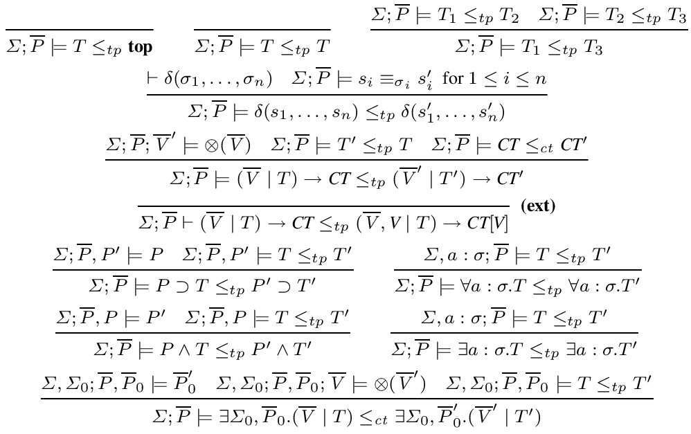

#### 図5. 短命な制約を表わすいくつかの規則

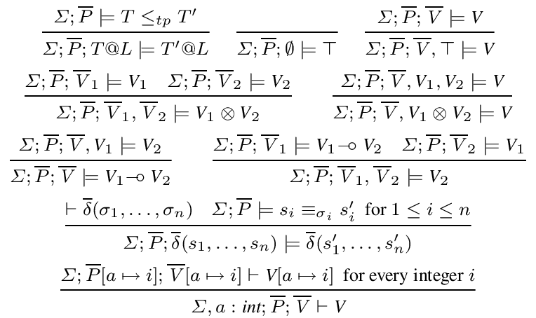

短命な制約の証明に対する規則のいくつかは図5で与えられます。
残りの規則はプリミティブな観のコンストラクタに関連しています。
証明コンストラクタ _c1_ ,..., _cn_ を伴なうプリミティブな観のコンストラクタ 𝛿 が与えられたとき、
それぞれの _ci_ について次の規則を導入します:

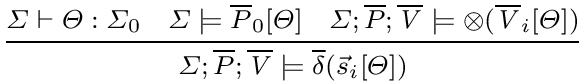

ここでは _ci_ には観 ∀ _Σi_ , _Ṕi_ .( _Ṽi_ ) ⊸ _𝛿_ ( _śi_ )
が割り当てられていると仮定しています;
さらに次の規則を導入します:

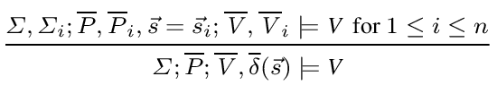

ここでの主張したい要点は、永続/短命な制約関係の両方が形式的に定義できるということです。

## 3. 例
### 3.1. 配列

```ocaml
(* 図6. 配列を表わすデータ観 *)
dataview arrayView (type, int, addr) =
  | {a:type, l:addr} ArrayNone (a, 0, 1)
  | {a:type, n:nat, l:addr}
      ArraySome (a, n+1, 1) of (a @ l, arrayView (a, n, l+1)
```

配列はおそらくプログラミングにおいて最も一般的に使われるデータ構造です。
図6で配列を表現するデータ観 (dataview) を宣言しています。
型 _T_ , 整数 _I_ , アドレス _L_ が与えられたとき、 _arrayView_ ( _T_ , _I_ , _L_ )
は次のように描写される配列を表わす観です。

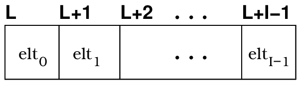

(1) 配列のそれぞれの要素の型は _T_ で、
(2) 配列の長さは _I_ で、
(3) 配列はアドレス _L_ から始まりアドレス _L_ + _I_ -1 で終わります。

観 _arrayView_ に関連する2つの観の証明コンストラクタ _ArrayNone_ と _ArraySome_ があります。
これらには次のような関数的な観が割り当てられています:

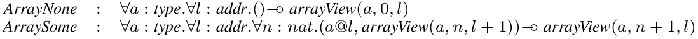

例えば _ArraySome_ に割り当てられた観は、もし 型 _T_ の値が _L_ に保管されていて、型 _T_
の値を含むサイズ _I_ の配列が _L_ + 1 に保管されているなら、型 _T_ の要素を含むサイズ _I_ + 1
の配列がアドレス _L_ に保管されていることを意味しています。

```ocaml
(* 図7. 配列を用いた簡単な関数 *)
fun getFirst {a:type, n:int, l:addr | n > 0}
   (pf: arrayView (a,n,l) | p: ptr(l)): '(arrayView (a,n,l) | a) =
  let
     prval ArraySome (pf1, pf2) = pf
     // pf1: a@l and pf2: arrayView (a,n-1,l+1)
     val '(pf1' | x) = getVar (pf1 | p)
     // pf1': a@l
  in
     '(ArraySome (pf1', pf2) | x)
  end
```

ここで単純な関数 _getFirst_ を図7に実装してみます。
この関数は空ではない配列の最初の要素を獲得します。
関数 _getFirst_ のヘッダは次の型がこの関数に割り当てられていることを示しています:


_getFirst_ の本体内の (馴染みのない) 構文には少し説明が必要でしょう:
_pf_ は観 _arrayView_ ( _a_ , _n_ , _l_ ) の証明です。
この証明は、 _pf1_ と _pf2_ がそれぞれ観
_a_ @ _l_ と _arrayView_ ( _a_ , _n_ - 1 , _l_ + 1 ) の証明のとき
_ArraySome_ ( _pf1_ , _pf2_ ) の形を取らなければなりません;
関数 _getVar_ は次の型であると仮定されていることを思い出しましょう:

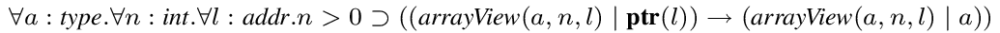

これは _getVar_ を型 __ptr__ ( _L_ ) のポインタに適用するにはなんらかの型 _T_ について _T_ @ _L_
の証明が要求され、この関数適用が型 _T_ の値および _T_ @ _L_ の証明を返すことを単純に意味しています;
従って _pf1'_ もまた _a_ @ _l_ の証明で、
_ArraySome_ ( _pf1'_ , _pf2_ ) は _arrayView_ ( _a_ , _n_ , _l_ ) の証明です。
_getFirst_ の定義は、動的な計算のコードと観の証明の静的な操作のコードの両方を持っています。
そしてその後者は、動的な計算が開始する前に消去されます。

### 3.2. 片方向リスト

```ocaml
(* 図8. 片方向リストのセグメントを表わすデータ観 *)
dataview slseg (type, int, addr, addr) =
  | {a:type, l:addr} SlsegNone (a, 0, l, l)
  | {a:type, n:nat, first, next, last | first <> null}
    SlsegSome (a, n+1, first, last) of
      ((a, ptr (next)) @ first, slseg (a, n, next, last))

viewdef sllist (a, n, l) = slseg (a, n, l, null)
```

片方向リストのセグメントを表現するデータ観を図8のように宣言できます。
観の列: _T0_ @ ( _L_ + 0 ) ,..., _Tn_ @ ( _L_ + _n_ ) を表わすのに
( _T0_ ,..., _Tn_ ) @ L と書いていることに注意してください。
型 _T_ , 整数 _I_ , 2つのアドレス _L1_ と _L2_ が与えらえたとき、
_slseg_ ( _T_ , _I_ , _L1_ , _L2_ )
は次のように描かれた片方向リストのセグメントを表わす観です:

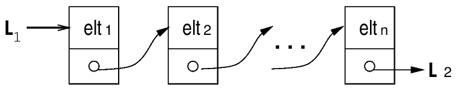

ここで (1) セグメントのそれぞれの要素の型は _T_ で、
(2) セグメントの長さは _n_ で、
(3) セグメントは _L1_ から始まり _L2_ で終わります。
片方向リストは単純に、NULL ポインタで終わるような片方向リストのセグメントの一種です。
そしてこれは図8で示された観コンストラクタ _sllist_ の定義を明確に反映されています。

ここで、図9に興味深い例を紹介します。
図の上側の関数 _array2sllist_ は配列を片方向リストに変換します。

xxx

```ocaml
(* 図9. 配列から片方向リストへの変換 *)
fun array2sllist {l:addr, n:nat | n >= 1, 1 <> null}
  (pf: arrayView (top, n+n, l) | p: ptr(l), s: int(n))
  : '(sllist (top, n, l) | unit) =
  if s ieq 1 then
    let
       prval ArraySome (pf0, ArraySome (pf1, ArrayNone)) = pf
       val '(pf1 | _) = setVar (pf1 | p + 1, null)
    in
       '(SlsegSome ('(pf0, pf1), SlsegNone) | '())
    end
  else
    let
       prval ArraySome (pf0, ArraySome (pf1, pf)) = pf
       val '(pf1 | _) = setVar (pf1 | p + 1, p + 2)
       val '(rest | _ ) = array2sllist (pf | p + 2, s - 1)
    in
       '(SlsegSome ('(pf0, pf1), rest) | '())
    end
```

```c
/* The following program in C corresponds the above one in ATS */

typedef struct slseg { int val; struct slseg * next; } slseg;

void array2sllist (int* p, int size) {
  int s;

  for (s = size; s > 1; s = s - 1) { *(p+1) = p+2; p = p+2; }

  *(p+1) = 0; /* assign the null pointer */
}
```

xxx
