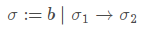
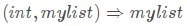
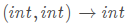

# ATSでの種、静的な世界、そして動的な世界

(元記事は http://blog.steinwaywu.com/sorts-statics-and-dynamics-in-ats/ です)

これは私の指導教官である Xi による興味深い話です。
そして、そのアイデアをここに適切に記そうと努力しようと思います。

## 型システムの要約

型システムとは型に関する体系です。
それらは**基本型**、**複合型**、そして**基本型を使って複合型を構築するための規則**を持っています。
また型システムには他に、いくつかの規則を使って項や式の型をどのように決定するかのような、本質的な理論があります。
Applied Type System を表わす ATS は型システムです。
それは独自の基本型、複合型を表現する規則、そして多くの関連する理論を持ちます。

型システムには異なる種類があります。
複合型を表現するために基本型を使い、さらなる複合型を表現するために複合型を使うかもしれません。
これは階層的な構造を持っています。
それらは**階層的な型システム**であると言えるのです。
その他の型システムは階層を持ちません。
これは Martin-Lof の型理論のような**循環した定義**を含んでいます。
ATS はこの階層的な型システムを選択しています。
(しかし、私の指導教官は彼のアイデアを、循環した定義の体系がいくつかの点でより先進的であると表現しました。)

ATS には型の基礎的なレベルと、その基礎の上に2つの型のレベルがあります。
それらはそれぞれ、**種 (sorts)**、**静的な世界 (statics)**、と**動的な世界 (dynamics)** です。
種は基礎的な型で、静的な世界を表現したりコンストラクトしたりします。
そして静的な世界は、動的な世界で使われる複合型をコンストラクトするために使われます。

## 静的な世界 (Statics)

静的な世界の前に、型の基礎的なレベルである種について説明しましょう。
ATS の論文では、種は次のように定義されています:



The  stands for basic sorts, which are sorts that can't be simpler, like bool, addr, type, and t@ype.
And  is also defined to be sort.
They can be regarded as the sort for functions. But in real ATS statics, it hasn't been supported yet, because there is actually no real lambda abstractions and function applications.
These sorts will be further used to describe (construct) static terms.
Terms refer to lambda terms, and they may be covered in the following blogs.
From my understanding, terms are the core part of statics and dynamics, and any other programming languages.
It represents those constructive components in a programming language, like variables, statements, functions and function calls, and so on.
In a typed language (I am not sure, but at least ATS), each term will be assigned a type.
Specifically, each static term will be assigned a sort using some rules.
This is what I mean by saying "use sorts to describe or construct static terms".

Statics could be regarded as a language to describe complex static terms. The syntax is well-defined in the paper, and the first syntax is the sort syntax shown above. The rests are

* static terms: 
* static variable context: 
* signatures: 
* static substitution: 

The static terms are quite similar to lambda terms in typed lambda calculus.  is variable.  is lambda abstraction, which stands for functions.  is function application, or function call. The only difference is . It is a special kind of function applications, which apply static constants  to static terms .

Static constants include static constant constructors like int(n), and static constant functions like + operator. Or you can just call them static constant functions, because they are essentially the same. Although they could both be classified as lambda abstractions or functions (or more precisely, predefined functions in ATS), ATS does so because of some practical implementation considerations. If you try to encode the plus operator using pure typed lambda calculus, that could be a lot of work. So ATS just extract them into a separate definition. I don't know too much about it currently, but I may explain it later when I learn more.  Come back to static constants. Their definitions are described in . The first part  contains  some predefined basic definitions. And the second part is an expansion rule which expands  to include a new signature  of the "sort" . In order to avoid the conflict between the sort for static constants, and the sort defined previously, ATS calls "sc-sort" for the sort of static constants. (There ARE lambda abstractions and function applications in ATS statics. You can define a sort in the form of . And you can apply it, too.) If you would like to gain some real feel, skip to the end for examples.

## 動的な世界 (Dynamics)

Dynamics are all about proofs and programs. In a word, you use dynamics to construct a real program, while you use statics to describe dynamics, or to write specifications of dynamics. Proofs are also programs, but they produce propositions to prove something. Dynamics are very similar to statics. Dynamic terms will be assigned types. Those types are static terms of sort type(or t@ype). There is also a formal definition for dynamic terms, dynamic values, variable context, and substitution.  But it is too complex for me now. I will cover that later on. Not that there is a "dynamic values". As far as I know, they are dynamic terms that couldn't be further simplified, like a termination token in a programming language grammar.

## 例

```ats
datasort mylist =  
 | nil of ()
 | cons of (int, mylist)
stadef list = cons (1, nil())
```

In this statics example, we defined a sort called mylist, which is part of the base sort  in the paper. The consis a static constant of sc-sort . The nil() and cons (1, nil()) are static constant applications, which are defined to be static terms, of sort mylist. The listis a static term, of sort mylist. Note that, the static constant should be of form  instead of .

```ats
fun myplus (a:int, b:int):int
```

In this dynamics example, we defined a function myplus, which is a dynamic term, of type . The type  is a static term of sort type. This static term is of the form of static constant application with the static constant being the  symbol. It is a static constant who takes static terms (of sort type) and produces static terms (of sort type). The  is defined as a member of  in the statics syntax. Please refer to the paper.

## 参考文献

ATS の論文は [ここ](http://www.ats-lang.org/MYDATA/ATS-types03.pdf) から入手できます。
